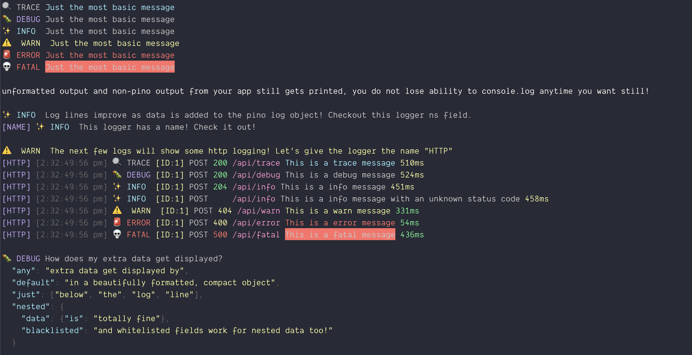

# pino-princess 👸 💅

A pretty dev logger for pino and other ndjson.

Largely inspired from the great pino-colada project but with all the bells and whistles of pino-pretty.

## Goals

[pino-pretty](https://github.com/pinojs/pino-pretty) is hard to configure and I didn't like the defaults. However, it was very good at always showing me all my data. Unfortunately, I didn't care about seeing all the data. For example, most of the time, req/res headers are just noise for me during development.

[pino-colada](https://github.com/lrlna/pino-colada) was an awesome output format, but it was inflexible. I couldn't see all my data when I wanted to because of its rigidity.

In order to get the best of both worlds, I started from a fork of pino-pretty, and developed a configurable, pino-colada like log prettifier that always displays all your data, except when you don't want it to!

You could probably get something pretty similar with just an advanced pino-pretty configuration, but if you prefer lower configuration and easier to understand defaults, choose pino-princess.

### Install

`npm install pino-princess --save-dev`
or
`yarn install -D pino-princess`

## Usage

### CLI

The reccomended usage of pino-princess is as a separate process from your main application which pipes pino logs from stdout into pino-princess for formatting.

`node my-application-which-logs-with-pino.js | npx pino-princess --blackList "severity" --whiteList "res.headers.ip, res.headers.x-my-important-header"`

### Pino v7 transport

pino-princess, as a fork of pino-pretty, is also set up to be used as a pino v7 transport. Please refer to the pino documentation to set this up.

## Configuration

pino-princess supports a simple configuration which can be supplied as either command line arguments, or alternatively, pino-princess.config.js file located in the path up from where the application is being ran.

These are `blackList`, `whiteList`, and `formatters`.
`blackList` and `whiteList` are both arrays of strings which represent the dotpath to any field on a deeply nested log object.
#### blackList
string[]

An array of strings which represent a key on any object. Keys matching any one of these strings cause these keys to be excluded from the log output. The blackList is always overridden by the whitelist. In this way, blackList can be used to exclude large base objects and the whiteList can be used to pick certain fields and "add them back" to the log output.

For example, by default, pino-princess blacklists the entire req or res object from any http logger. Because some fields on req and res are required to constuct the core of the log line, these fields are added back via the whiteList.

default value: `['req', 'res']`

#### whiteList
string[]

An array of strings which represent a key on any object. Keys matching any one of these strings cause these keys will ensure the key is always part of the log output. The whiteList always overrides by the blackList. In this way, whiteList can be used to "add back" properties of blackListed objects to the log output.

By default pino-princess whiteLists all the properties required to create our standard log line.

default value: `['res.statusCode', 'req.method', 'req.url', 'level', 'name', 'ns', 'msg', 'responseTime']`

